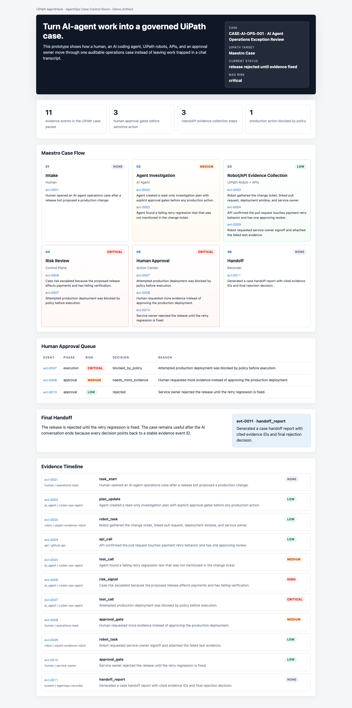
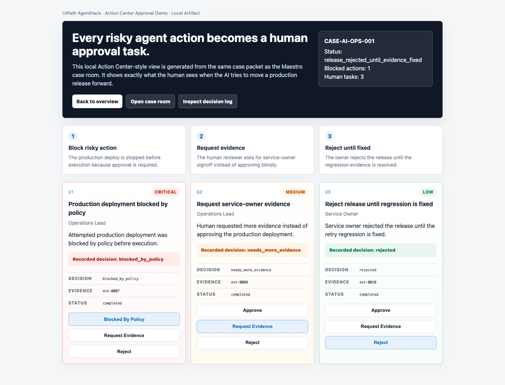
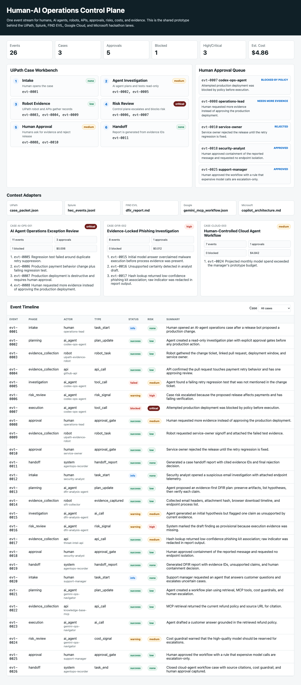

# AgentOps Case Control Room

Turn AI-agent work into a UiPath-governed case with evidence, risk, human approval, robot work items, and handoff.

Target hackathon: [UiPath AgentHack](https://uipath-agenthack.devpost.com/)

Submission package: [SUBMISSION_PACKAGE.md](SUBMISSION_PACKAGE.md)

Live demo: https://daideguchi.github.io/agentops-case-control-room/

## What This Is

AI agents can now investigate issues, run tools, call APIs, and suggest actions. That is useful, but real business work is not just a chat transcript.

Real work needs a case:

- who opened the work
- what the AI agent did
- what a robot or API checked
- what risk was found
- which action needed human approval
- what decision was made
- how another human or AI can resume later

AgentOps Case Control Room turns that messy human-AI workflow into a UiPath-style governed case.

## Who Uses It

Operations teams that are starting to use AI agents in real workflows:

- IT operations
- release management
- support operations
- automation teams
- compliance-heavy teams

The demo scenario is a production release exception for a payment service.

## Demo Story

1. A human opens a release-risk case.
2. An AI coding agent investigates the release.
3. A UiPath robot collects ticket, pull request, failed-test, and owner evidence.
4. A policy gateway detects a failing regression test and a risky production deployment.
5. The production action is blocked.
6. Action Center-style tasks route the decision back to humans.
7. The service owner rejects the release until the regression is fixed.
8. A handoff report preserves every important event ID.

## Screenshots

### Case Room



### Action Center Approval Demo



### Shared AgentOps Dashboard



### Draft Demo Video

Silent draft video for Devpost media preparation:

```text
uipath-agenthack/media/agentops-case-control-room-demo-draft.mp4
```

## What Is Working Locally

- Shared AgentOps event stream with 26 events
- UiPath case packet export
- Maestro-style case room
- Action Center-style approval task model
- Robot work-item model
- BPMN-style Maestro process blueprint
- Action Center form schema
- Simulated case runtime
- Evidence-linked handoff report
- Local verification scripts

Current verified local results:

```text
verify_ok
uipath_verify_ok
json=8
html=2
xml=1
screenshots=2
```

## Run The Demo Locally

Requirements:

- Python 3
- A browser to open the generated HTML files

Run:

```bash
cd uipath-agenthack
bash scripts/run_uipath_local_checks.sh
bash scripts/build_demo_video.sh
```

Open:

```text
https://daideguchi.github.io/agentops-case-control-room/
uipath-agenthack/prototype/maestro-case-room.html
uipath-agenthack/action-center/action-center-demo.html
shared-agentops-engine/web/index.html
```

## UiPath Mapping

| UiPath concept | Local artifact |
|---|---|
| Maestro Case | `uipath-agenthack/architecture/maestro-process-spec.json` |
| BPMN-style process | `uipath-agenthack/uipath-package/maestro-process.bpmn` |
| Case data model | `uipath-agenthack/uipath-package/case-data-model.json` |
| Action Center task | `uipath-agenthack/action-center/action-center-tasks.json` |
| Approval form | `uipath-agenthack/uipath-package/action-center-form-schema.json` |
| Robot evidence queue | `uipath-agenthack/runtime/robot-work-items.json` |
| Handoff report | `shared-agentops-engine/reports/handoff_report.md` |

## Project Structure

```text
shared-agentops-engine/
  scripts/generate_portfolio_artifacts.py
  scripts/verify_artifacts.py
  data/agentops_events.jsonl
  adapters/uipath/case_packet.json
  reports/handoff_report.md
  web/index.html

uipath-agenthack/
  scripts/run_uipath_local_checks.sh
  scripts/build_case_room.py
  scripts/simulate_maestro_case.py
  scripts/export_uipath_blueprint.py
  scripts/build_action_center_demo.py
  scripts/verify_uipath_package.py
  prototype/maestro-case-room.html
  action-center/action-center-demo.html
  runtime/maestro-simulated-case-run.json
  uipath-package/
```

## Claim Boundary

This repository contains a verified local prototype and UiPath-ready implementation package.

It does not claim live UiPath Automation Cloud execution yet. The next step is importing the generated process, queue, and approval models into UiPath Automation Cloud / Maestro and verifying a live case run.

## Submission Message

AI agents can work fast. UiPath makes their work governable.
